# ZCAM Gallery Plus – App Structure & Dependency Map

This document provides a visual and textual map of the application's structure and major dependencies. It is intended as a living reference to help developers and AI agents quickly orient themselves, especially as the project grows in complexity.

## Visual Map

```mermaid
flowchart TD
  A["App Structure Overview"]
  A --> B1["App.jsx (Main Container)"]
  B1 --> B2["Feature Modules"]
  B2 --> C1["Gallery (GalleryView.tsx, Thumbnail.tsx, ThumbnailCell.jsx, MemoizedGridCell.jsx)"]
  B2 --> C2["Preview (Preview Overlay, Thumbnail, Video Preview)"]
  B2 --> C3["Settings (User Preferences, Dark/Light Mode)"]
  B2 --> C4["Progress (ProgressBar.jsx, Progress Reporting)"]
  B1 --> D1["Services"]
  D1 --> D2["AutoIngestService.js"]
  D1 --> D3["ZCamConnector.js"]
  D1 --> D4["fileSystem.js"]
  B1 --> E1["Types"]
  E1 --> E2["types.ts"]
  B1 --> F1["Taskmaster Integration"]
  F1 --> F2["tasks/tasks.json, task_*.txt"]
  B1 --> G1["Assets & Config"]
  G1 --> G2["assets/ (static files)"]
  G1 --> G3["config/ (app config)"]
  B1 --> H1["Public"]
  H1 --> H2["public/vite.svg"]
  B1 --> I1["Scripts"]
  I1 --> I2["scripts/prd.txt, example_prd.txt"]
  B1 --> J1["Testing (Planned)"]
  J1 --> J2["tests/ (unit/integration tests)"]
  B1 --> K1["Documentation"]
  K1 --> K2["README.md, .taskmasterconfig"]
  B1 --> L1["Build & Config"]
  L1 --> L2["package.json, vite.config.js, eslint.config.js"]
  B1 --> M1["Node Modules"]
  M1 --> M2["node_modules/"]
```

## How to Use
- Reference this file at any time to understand the app's structure.
- Update the diagram and notes as new modules, features, or dependencies are added.
- Use this as a starting point for onboarding, refactoring, or dependency analysis.

---

_Last updated: 2024-06-06_

### Thumbnail Rendering & Download Progress
- Each grid cell receives only its own download progress as a prop.
- Download progress state updates are throttled to 500ms.
- Only the affected thumbnail cell re-renders when its progress changes.
- This minimizes UI jank and improves gallery responsiveness during downloads.
- See `src/App.jsx` for details. 